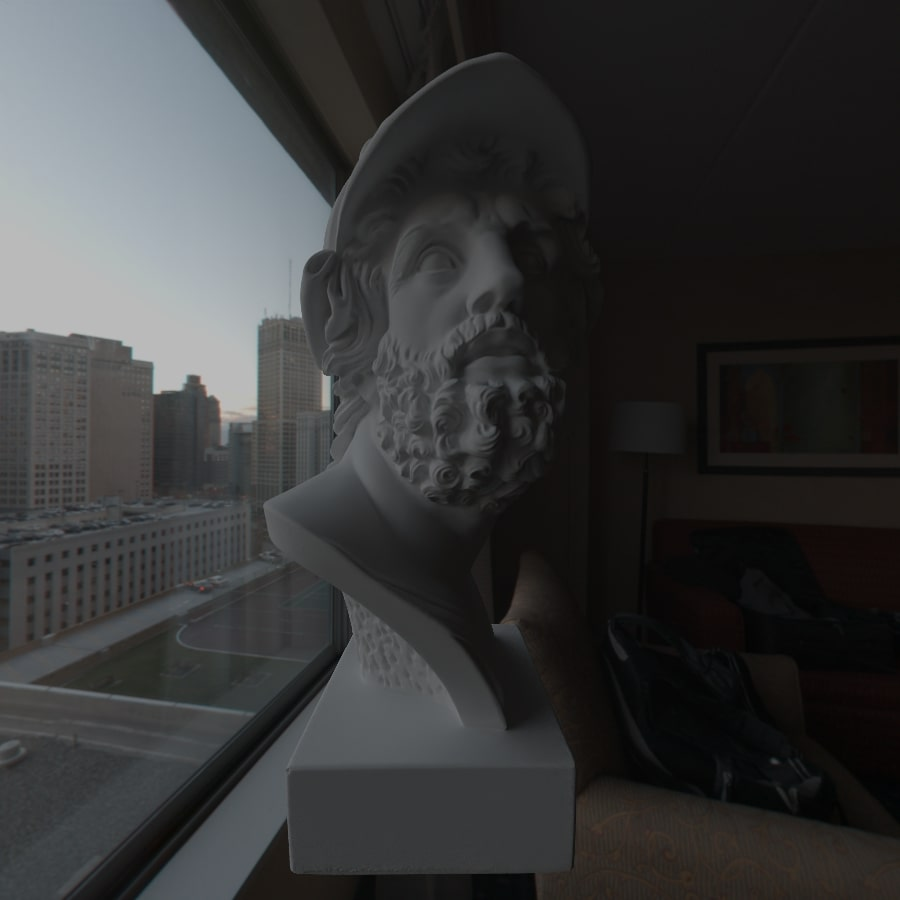
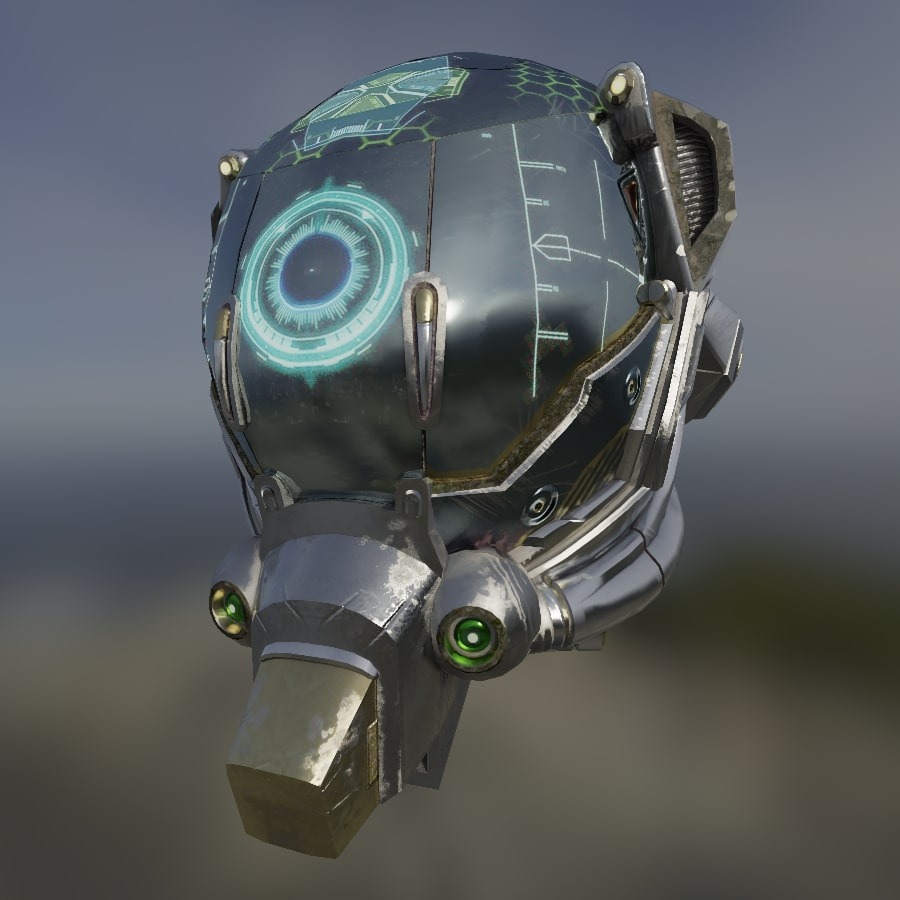
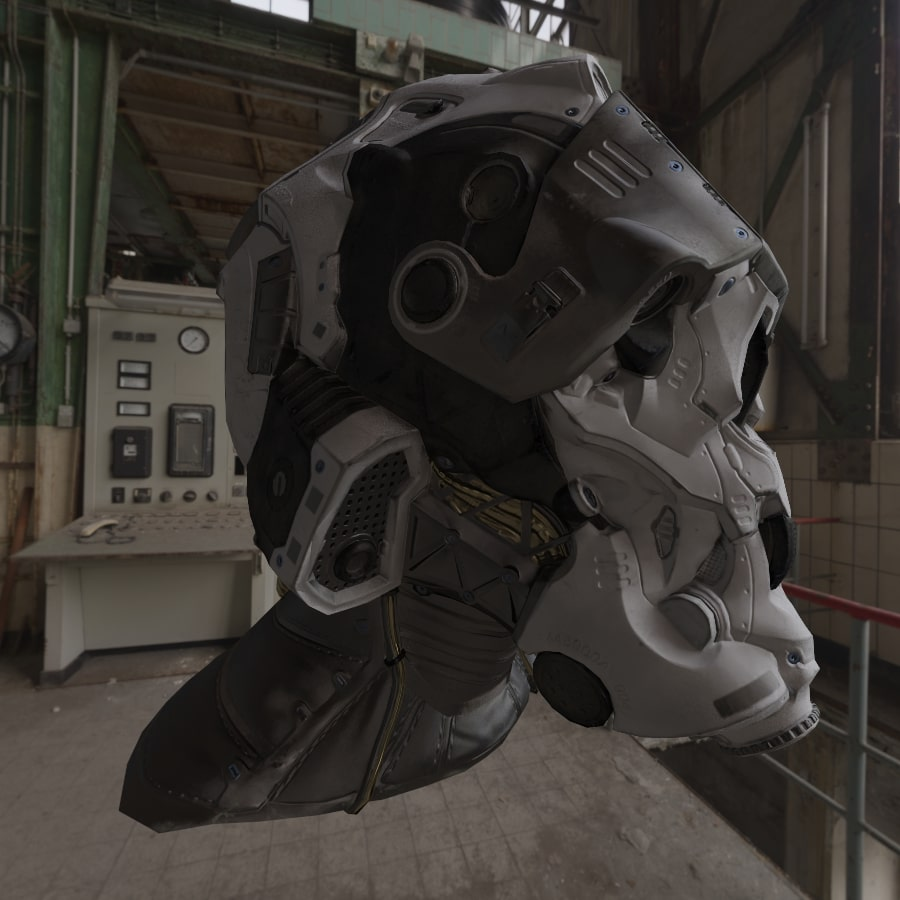
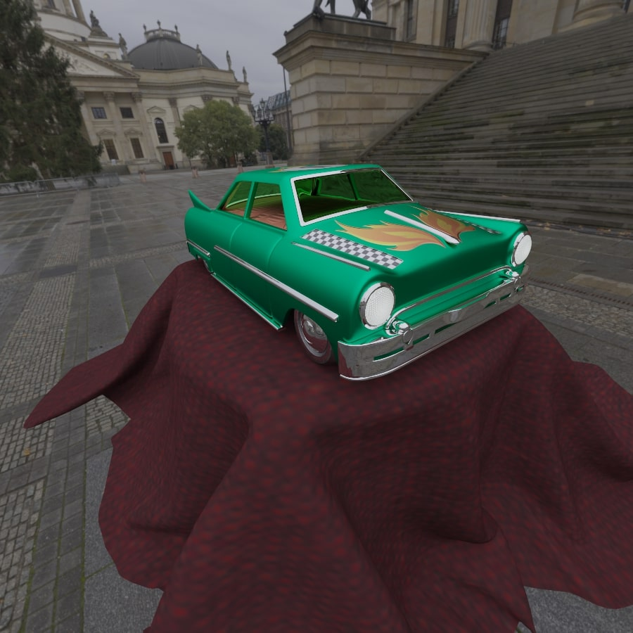

# TracerX

This path tracing app is a computer graphics program that simulates the behavior of light in a virtual environment. It is based on the principles of [physically based rendering (PBR)]((https://learn.microsoft.com/en-us/azure/remote-rendering/overview/features/pbr-materials)), which aims to create more realistic and accurate images by simulating the physical properties of light and materials.

This renderer was inspired by the book series [_Ray Tracing in One Weekend_](https://raytracing.github.io/) and [knightcrawler25/GLSL-PathTracer](https://github.com/knightcrawler25/GLSL-PathTracer)

# Renders





# Features
- GLTF scenes
- Bounding volume hierarchy
- Environments
- Image denoising
- Camera lens distortion:
    - Focal distance
    - Aperture
- Progressive rendering for fast and efficient image generation
- Supports a range of material types, including (for more information visit [PBR materials](https://learn.microsoft.com/en-us/azure/remote-rendering/overview/features/pbr-materials)):
    - Albedo textures
    - Roughness textures
    - Metalness textures
    - Emission textures
    - Normal textures
    - Fresnel
    - Refraction
- Visual mode for easy manipulation of the environment and materials

# Visual Mode Control
- С - start/stop camera control mode
- W, A, S, D - camera left, right, forward, backward movement
- LShift, LCtrl - camera up, down movement
- Mouse - camera rotation
- Q, E - camera tilt

# Getting Started
## Building
```bash
cd ./build
cmake ..
make
```

# External
## Libraries
- [brandonpelfrey/Fast-BVH](https://github.com/brandonpelfrey/Fast-BVH) (Modified version): A Simple, Optimized Bounding Volume Hierarchy for Ray/Object Intersection Testing
- [nigels-com/glew](https://github.com/nigels-com/glew): The OpenGL Extension Wrangler Library
- [glfw/glfw](https://github.com/glfw/glfw): A multi-platform library for OpenGL, OpenGL ES, Vulkan, window and input
- [g-truc/glm](https://github.com/g-truc/glm): OpenGL Mathematics (GLM)
- [ocornut/imgui](https://github.com/ocornut/imgui): Bloat-free Graphical User interface for C++ with minimal dependencies
- [CedricGuillemet/ImGuizmo](https://github.com/CedricGuillemet/ImGuizmo): Immediate mode 3D gizmo for scene editing and other controls based on Dear Imgui
- [OpenImageDenoise/oidn](https://github.com/OpenImageDenoise/oidn): Intel® Open Image Denoise library
- [nothings/stb](https://github.com/nothings/stb): stb single-file public domain libraries for C/C++
- [cxong/tinydir](https://github.com/cxong/tinydir): Lightweight, portable and easy to integrate C directory and file reader
- [syoyo/tinygltf](https://github.com/syoyo/tinygltf): Header only C++11 tiny glTF 2.0 library

## Assets
- [KhronosGroup/glTF-Sample-Assets](https://github.com/KhronosGroup/glTF-Sample-Assets): To store all models and other assets related to glTF
- [Patitotective/ImThemes](https://github.com/Patitotective/ImThemes): Dear ImGui style browser and editor written in Nim
