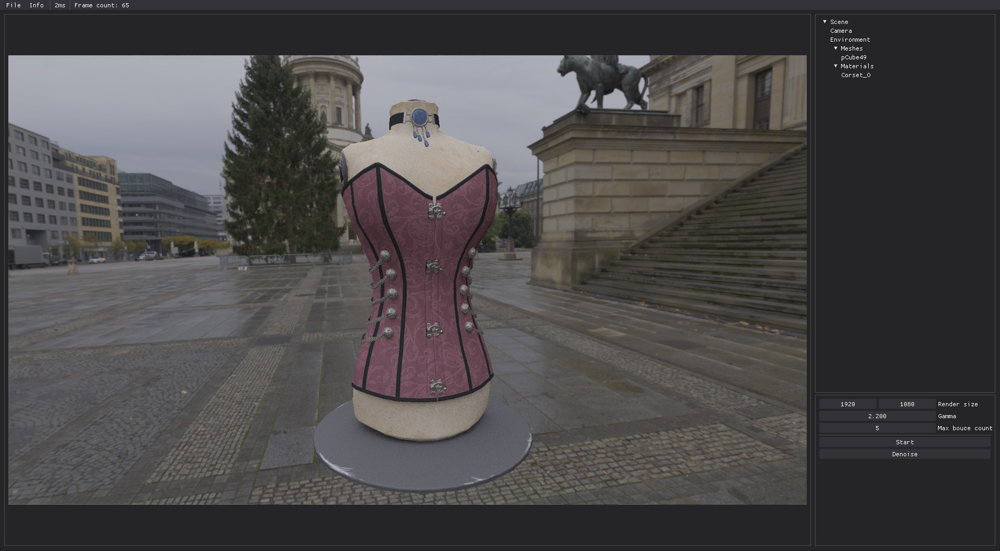
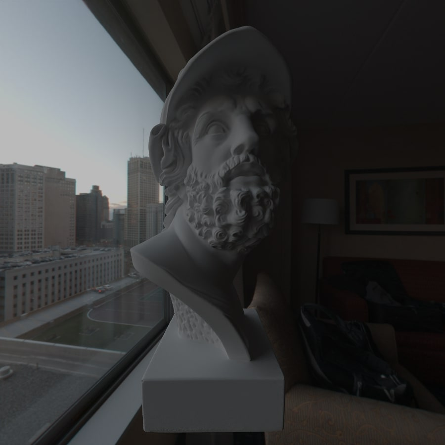
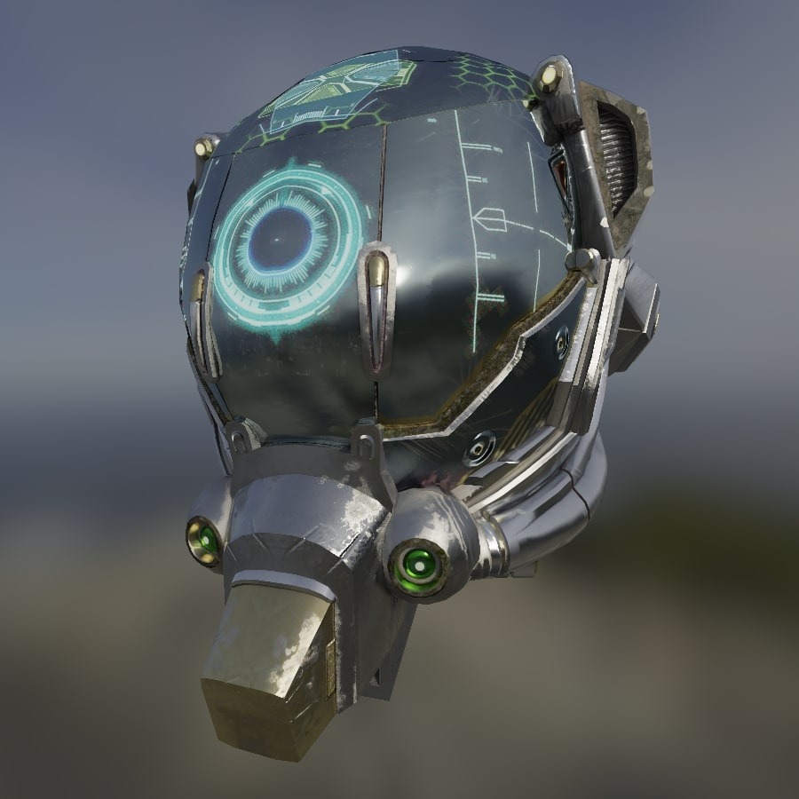
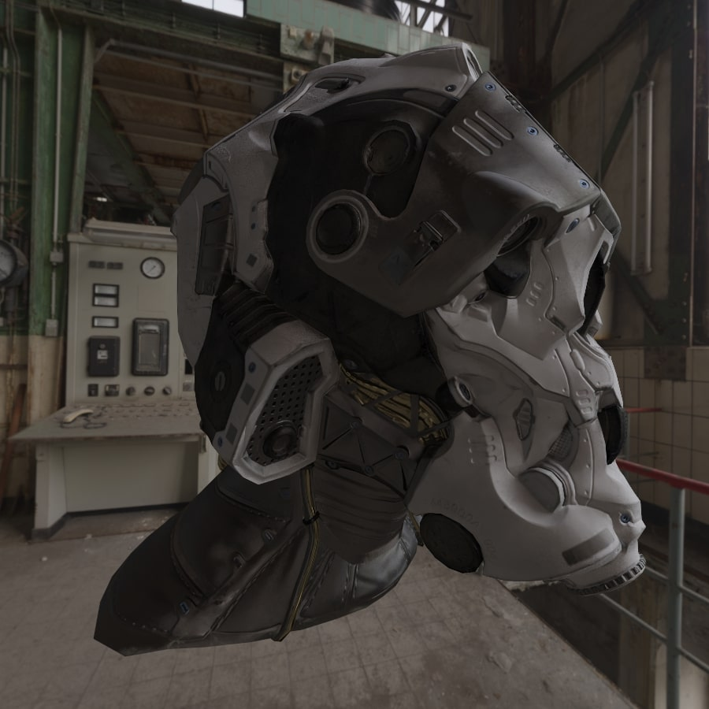
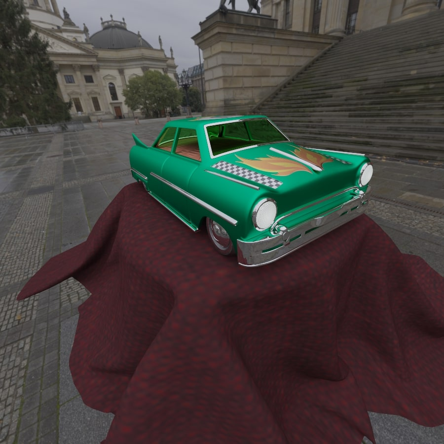

# TracerX
This path tracing app is a computer graphics program that simulates the behavior of light in a virtual environment.
It is written in **C++** and uses **OpenGL** compute shaders for rendering.
TracerX is based on the principles of the microfacet model and uses the Bidirectional Scattering Distribution Function (BSDF) to simulate the interaction of light with materials.

This repository contains three main projects:
- `core`: The core library that implements the path tracing algorithm
- `app`: The graphical user interface (GUI) that allows users to interact with the library
- `example`: An example project that demonstrates how to use the core library to generate images

Additional assets can be downloaded here and installed in the directory:
- `app/assets/environments`: [Poly Haven](https://polyhaven.com/hdris)
- `app/assets/scenes`: [KhronosGroup/glTF-Sample-Assets](https://github.com/KhronosGroup/glTF-Sample-Assets) or [Sketchfab](https://sketchfab.com/)

# Renders






# Features
- GLTF scenes
- Bounding volume hierarchy
- Environments
- Image denoising
- Camera lens distortion:
    - Focal distance
    - Aperture
- Progressive rendering
- Supports a range of material types, including:
    - Albedo textures
    - Roughness textures
    - Metalness textures
    - Emission textures
    - Normal textures
    - Fresnel
    - Refraction

# Getting Started
## CMake Configuration
| Name             | Description                   | Default value |
|------------------|-------------------------------|---------------|
| TX_DENOISE       | Include denoise functionality | ON            |
| TX_BUILD_EDITOR  | Build graphic editor          | ON            |
| TX_ASSETS_PATH   | Assets folder                 | "app/assets"  |
| TX_BUILD_EXAMPLE | Build example                 | OFF           |

## Building
This project uses CMake 3.10 or higher.
To generate the corresponding build files, run the following commands:
```bash
mkdir build
cd ./build
cmake ..
```

## Building the documentation
This project offers Doxygen documentation.
To generate the documentation, run the following commands:
```bash
cd ./docs
doxygen
```

## Debugging the shaders
The source shader code can be found in the `shaders` directory.
You can modify and rebuild the shaders by running the `scripts/build_shaders.py` python script.
In order to run the script, you need to have Python 3 and the **glslc** compiler installed on your system.
By running this script, the shaders will be compiled into **SPIR-V** format and saved in the `core/src/RendererShaderSrc.cpp` file.
Each time you rebuild the shaders, you need to rebuild the project to see the changes.

# External
## Libraries
- [brandonpelfrey/Fast-BVH](https://github.com/brandonpelfrey/Fast-BVH) (Modified version): A Simple, Optimized Bounding Volume Hierarchy for Ray/Object Intersection Testing
- [nigels-com/glew](https://github.com/nigels-com/glew): The OpenGL Extension Wrangler Library
- [g-truc/glm](https://github.com/g-truc/glm): OpenGL Mathematics (GLM)
- [OpenImageDenoise/oidn](https://github.com/OpenImageDenoise/oidn): Intel® Open Image Denoise library
- [nothings/stb](https://github.com/nothings/stb): stb single-file public domain libraries for C/C++
- [syoyo/tinygltf](https://github.com/syoyo/tinygltf): Header only C++11 tiny glTF 2.0 library
- [glfw/glfw](https://github.com/glfw/glfw): A multi-platform library for OpenGL, OpenGL ES, Vulkan, window and input
- [ocornut/imgui](https://github.com/ocornut/imgui): Bloat-free Graphical User interface for C++ with minimal dependencies
- [CedricGuillemet/ImGuizmo](https://github.com/CedricGuillemet/ImGuizmo): Immediate mode 3D gizmo for scene editing and other controls based on Dear Imgui
- [vareille/tinyfiledialogs](https://sourceforge.net/projects/tinyfiledialogs/): Tiny file dialogs ( cross-platform C C++ )

## Assets
- [KhronosGroup/glTF-Sample-Assets](https://github.com/KhronosGroup/glTF-Sample-Assets): To store all models and other assets related to glTF
- [Patitotective/ImThemes](https://github.com/Patitotective/ImThemes): Dear ImGui style browser and editor written in Nim

# Aknowledgements
- [Ray Tracing in One Weekend](https://raytracing.github.io/) is a series of books by Peter Shirley that explain the fundamentals of ray tracing.
- [knightcrawler25/GLSL-PathTracer](https://github.com/knightcrawler25/GLSL-PathTracer) is a path tracing project that inspired the development of this app.
- [Physically Based Rendering: From Theory to Implementation](https://pbr-book.org/) is a book by Matt Pharr, Wenzel Jakob, and Greg Humphreys that provides a comprehensive overview of physically based rendering.