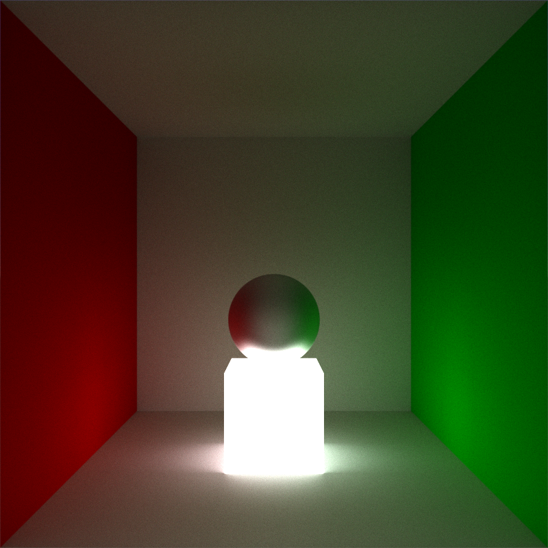

# TracerX

This ray tracing app is a computer graphics program that simulates the behavior of light in a virtual environment. It is based on the principles of [physically based rendering (PBR)]((https://learn.microsoft.com/en-us/azure/remote-rendering/overview/features/pbr-materials)), which aims to create more realistic and accurate images by simulating the physical properties of light and materials.

This renderer was inspired by the book [_Ray Tracing in One Weekend_](https://raytracing.github.io/books/RayTracingInOneWeekend.html)

# Renders



# Features
- Supports several geometries, including:
    - Spheres
    - Axis-aligned boxes
    - Triangles
- Configurable ray per frame count to control the quality of the output image
- Implements a simple environment that can be configured to your liking
- Allows camera lens distortion to be adjusted, including:
    - Focal length
    - Blur strength
- Uses progressive rendering for fast and efficient image generation
- Supports a range of material types, including (for more information visit [PBR materials](https://learn.microsoft.com/en-us/azure/remote-rendering/overview/features/pbr-materials)):
    - Albedo
    - Roughness
    - Metalness
    - Emission
    - Fresnel
    - Refraction
- Provides a visual mode for easy manipulation of the environment and materials
- Offers a command-line interface (CLI) for advanced users

# Visual Mode Control
- WASD - camera left, right, forward, backward movement
- LShif, LCtrl - camera up, down movement
- Mouse - camera rotation
- Q, E - camera tilt
- R - save current image

# Getting Started
```c++
#include "Renderer.h"

int main()
{
    Material red(Vector3f(1, 0, 0), 1);
    Material green(Vector3f(0, 1, 0), 1);
    Material white(Vector3f(1, 1, 1), 1);
    Material lightSource = Material::LightSource(Vector3f(1, 1, 1), 2);
    Material glass = Material::Transparent(Vector3f(1, 1, 1), .5f, Vector3f(1, 1, 1), .4f);

    Renderer renderer(Vector2i(900, 900), Camera(Vector3f(0, 0, -3), Vector3f(0, 0, 1), Vector3f(0, 1, 0), 3, .005f), 5, 5);
    
    renderer.addCornellBox(white, white, red, green, white, white, lightSource);
    renderer.add(Sphere(Vector3f(0, -.5f, 0), .5f), glass);

    renderer.loadScene();

    renderer.runVisual();
    return 0;
}
```

# External libraries
- [SFML/SFML](https://github.com/SFML/SFML): Used for rendering images and creating windows
- [ocornut/imgui](https://github.com/ocornut/imgui) / [SFML/imgui-sfml](https://github.com/SFML/imgui-sfml): Used for user interface
- [Bly7/OBJ-Loader](https://github.com/Bly7/OBJ-Loader): Used for loading obj files