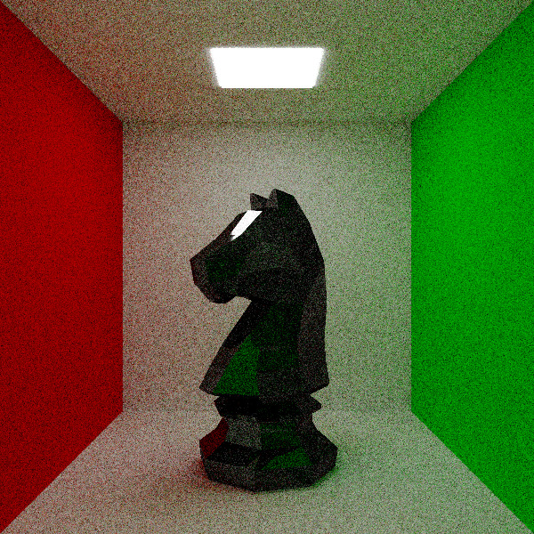

# TracerX

This ray tracing app is a computer graphics program that simulates the behavior of light in a virtual environment. It is based on the principles of [physically based rendering (PBR)]((https://learn.microsoft.com/en-us/azure/remote-rendering/overview/features/pbr-materials)), which aims to create more realistic and accurate images by simulating the physical properties of light and materials.

This renderer was inspired by the book series [_Ray Tracing in One Weekend_](https://raytracing.github.io/)

# Renders




# Features
- Supports several geometries, including:
    - Spheres
    - Axis-aligned boxes
    - Triangles
- Configurable ray per frame count to control the quality of the output image
- Implements a simple environment that can be configured to your liking
- Allows camera lens distortion to be adjusted, including:
    - Focal length
    - Blur strength
- Uses progressive rendering for fast and efficient image generation
- Supports a range of material types, including (for more information visit [PBR materials](https://learn.microsoft.com/en-us/azure/remote-rendering/overview/features/pbr-materials)):
    - Albedo
    - Roughness
    - Metalness
    - Emission
    - Fresnel
    - Refraction
- Provides a visual mode for easy manipulation of the environment and materials
- Tools for creating animations
- Camera motion blur

# Visual Mode Control
- WASD - camera left, right, forward, backward movement
- LShift, LCtrl - camera up, down movement
- Mouse - camera rotation
- Q, E - camera tilt
- Enter - exit camera control mode

# Getting Started
## Building
```bash
cd ./build
cmake ..
make
```

## Creating an Animation
To create an animation, follow these steps:
- The __animCreator/main.py__ script will generate a configuration file that contains the animation-specific settings and instructions for the main ray tracing application.
- Open the main ray tracing application and load the generated configuration file. This file will provide the necessary information for rendering the animation frames.
- Once you have rendered the individual frames of the animation, you can use external tools like __ffmpeg__ to convert the frames into a final animation file.  
Ensure that you have ffmpeg installed on your system.
Below is an example command to create an animation from the rendered frames
```bash
ffmpeg -framerate 30 -i img%00d.png -c:v libx264 -profile:v high -crf 20 -pix_fmt yuv420p output.mp4
```

# External libraries
- [SFML/SFML](https://github.com/SFML/SFML): Used for rendering images and creating windows
- [glfw/glfw](https://github.com/glfw/glfw): Used for OpenGL API 
- [ocornut/imgui](https://github.com/ocornut/imgui) / [SFML/imgui-sfml](https://github.com/SFML/imgui-sfml): Used for rendering user interface
- [Bly7/OBJ-Loader](https://github.com/Bly7/OBJ-Loader): Used for loading obj files